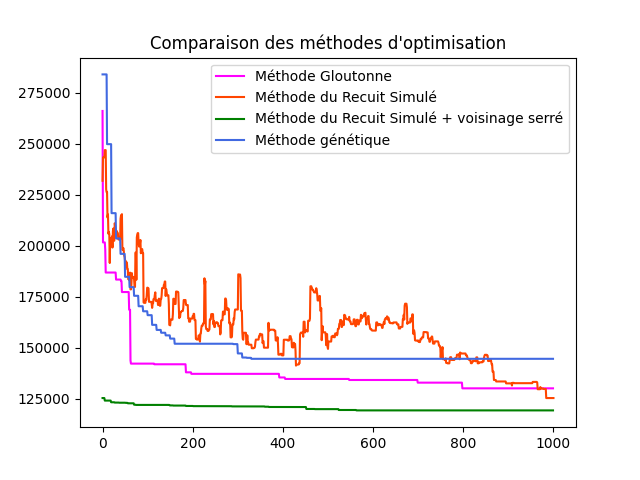
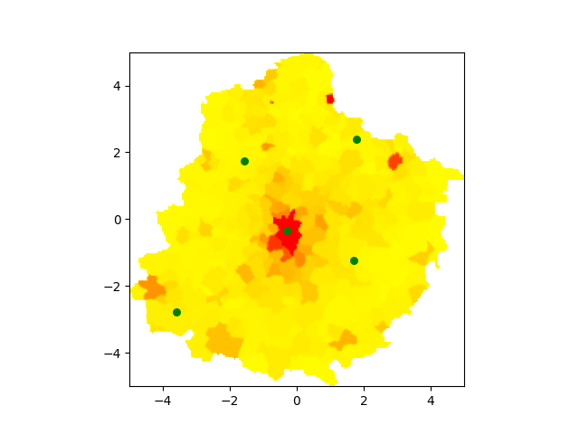

# Hospital Placement Algorithms for Medical Deserts

This project implements multiple algorithms for the optimal placement of hospitals in medical deserts based on density matrices. The algorithms include Random Solution, Greedy Algorithm, Simulated Annealing, Taboo Search (doesn't work), and Genetic Algorithm.
The presentation/Writeup on this project is available in the [TIPE.pdf](TIPE.pdf) file.




## Installation

1. Clone this repository to your local machine.
2. Install the required dependencies using pip:

```bash
pip install -r requirements.txt
```

## Color Code for Resulting Graphs

- **Green**: Greedy Algorithm
- **Dark Violet**: Simulated Annealing Algorithm
- **Light Blue**: Greedy Algorithm with Tight Neighborhood
- **Royal Blue**: Genetic Algorithm
- **Deep Pink**: Taboo Algorithm

## Usage

1. Adjust parameters such as matrix size, number of hospitals, and algorithm loops as needed in the config file.
2. Run the main script `main.py` to execute the algorithms and generate comparative graphs.

## Algorithms Used

- **Greedy Algorithm**: Selects the best local choice at each step without considering future consequences.
- **Simulated Annealing**: Uses a probabilistic approach to find global optima by accepting worse solutions with a decreasing probability.
- **Greedy Algorithm with Tight Neighborhood**: Applies a Greedy Algorithm with a limited search range around chosen points.
- **Genetic Algorithm**: Evolves solutions using concepts of natural selection, crossover, and mutation.
- **Taboo Search**: Avoids revisiting recently visited solutions to escape local optima.

## Files and Modules

- **DensityMatrix.py**: Generates density matrices for testing.
- **RandomSolution.py**: Implements a random solution approach.
- **GreedyAlgorithm.py**: Contains the Greedy Algorithm logic.
- **RecuitSimuleAlgorithm.py**: Implements the Simulated Annealing Algorithm.
- **TabooSearchAlgorithm.py**: Implements the Taboo Search Algorithm.
- **GeneticAlgorithm.py**: Implements the Genetic Algorithm.
- **EvaluateFunction.py**: Evaluates solution quality based on matrix density.
- **Sarthe.py**: Generates specific density matrices (optional).

## Graphs and Results

The program generates comparative graphs for each algorithm's performance in hospital placement based on density matrices. The color codes used in the scatter plots correspond to the colors in the algorithm labels.

## Logging

Logging is enabled using the `logger.ini` configuration file.

## Contributing

Contributions to optimize algorithms, improve documentation, or add new features are welcome! Please open issues or submit pull requests.

## License

This project is licensed under the MIT License - see the [LICENSE](LICENSE) file for details.
